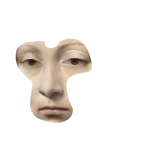
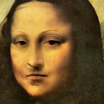

# Poisson blending
Poisson Image Editing によってシームレスな画像合成を行います。

## 実行環境
- Rust をインストール済み
- Cargo を実行可能

## インストール
```bash
git clone --depth=1 https://github.com/himeyama/poisson-blending ~
cd poisson-blending
cargo install --path .
```

## デモンストレーション
```bash
cd ~/poisson-blending/docs/images
poisson-image-editing
```

## 仕様
`target.png` と `source.png` から `output.png` を合成します。(ファイル名は指定できません。)

- target.png  
  
- source.png  
  
- output.png  
  

合成の計算回数は 10 回です。(回数は指定できません。)

## 参考
- http://opencv.jp/opencv2-x-samples/poisson-blending/
- https://www.jstage.jst.go.jp/article/itej/64/5/64_5_729/_pdf